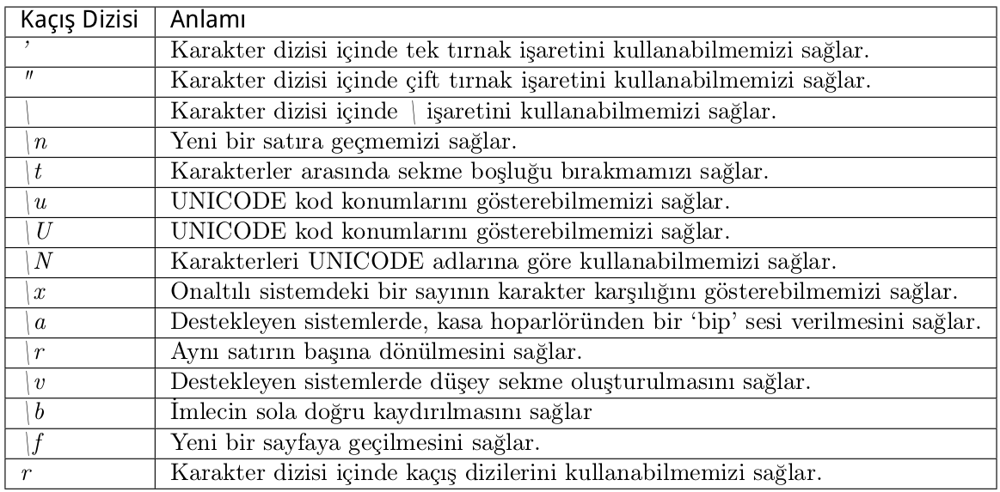

# [blog](https://www.woosal.com/)
# [codes](/main/)
# [others](/others/)

### interesting python stuff:

```python
class C:
    def m(self):
        return "result"

an_object = C()

class_method = getattr(C, "m")
result = class_method(an_object)

print(result)
```

```python
def f():
    return "result"

function_name = "f"
result = eval(function_name + "()")

print(result)
```

```python
# take an input of multiple inputs and convert them into
# a numpy array with all float converted

arr = np.array([i for i in (input().split() for _ in range(n))]).astype(np.float)
```

```python
>>> print 'ab123'.isalnum()
True
>>> print 'ab123#'.isalnum()
False
```

```python
>>> print 'abcD'.isalpha()
True
>>> print 'abcd1'.isalpha()
False
```

```python
>>> print '1234'.isdigit()
True
>>> print '123edsd'.isdigit()
False
```

```python
>>> print 'abcd123#'.islower()
True
>>> print 'Abcd123#'.islower()
False
```

```python
>>> print 'ABCD123#'.isupper()
True
>>> print 'Abcd123#'.isupper()
False
```

```python
import os
os.getcwd()
```

```python
import keyword
keyword.kwlist
```

```python
f = open("demo.txt", "w")
sys.stdout = f
```

```python
print("\a") # bell sound
```

```python
print("Hello\rWorld!") # World!
```

```python
print("Hello\vWorld!")
```

```python
print("yahoo.com\b.uk") # yahoo.co.uk
print('istihza\b\b\bsn') # istisna
```

```python
print("Dosya konumu: C:\\users\\zeynep\\gizli\\dosya.txt") # else unicode error
```

```python
import unicodedata
unicodedata.name('a') # LATIN SMALL LETTER A
```

```python
print("\N{LATIN SMALL LETTER A}") # a
print("\N{LATIN CAPITAL LETTER S WITH CEDILLA}") # ş
```

```python
# hexadecimals
print("\x41") # A
```

```python
print(r"Kurulum dizini: C:\aylar\nisan\toplam masraf")
# Kurulum dizini: C:\aylar\nisan\toplam masraf

print("Kurulum dizini: C:\aylar\nisan\toplam masraf") 
# Kurulum dizini: C:ylar
# isan
# oplam masraf

print(r"sa" + r"\t" + "sa") # sa\tsa
print(r"sa" + "\t" + "sa") # sa    sa
```

### list of all the available escape chars



